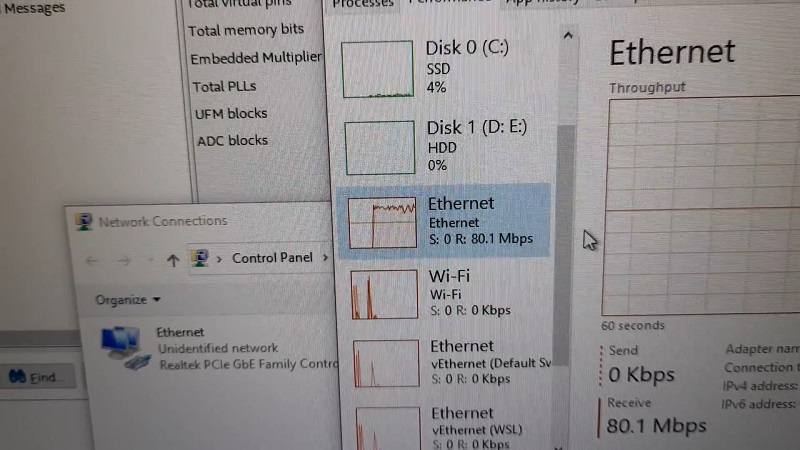
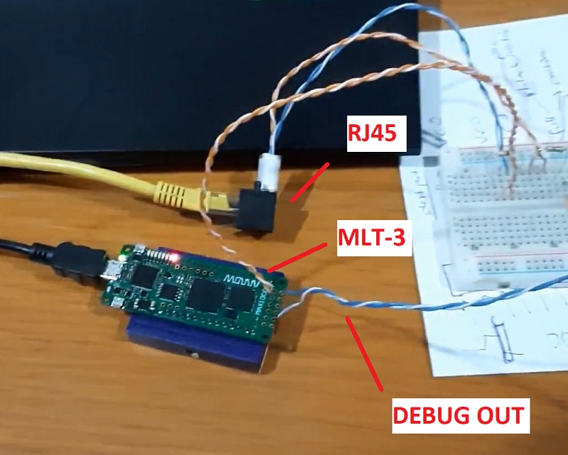
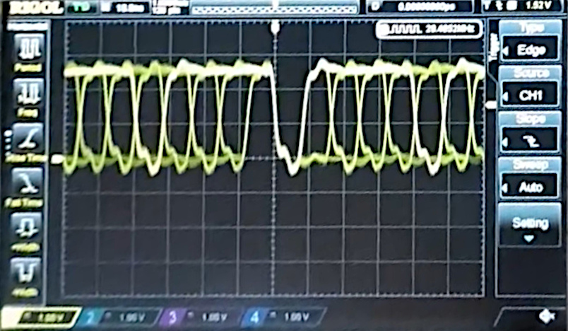

# max1k-barebone-eth
A simple 100BASE-TX demo using barebone MAX1000 IO pins. See [100BASE-TX](https://en.wikipedia.org/wiki/Fast_Ethernet#100BASE-TX).

## Usage
Connect `PIO[0]` and `PIO[1]` pins to an ethernet connector (with or without transformer) with a pair of 47 Ohm series resistors. 

Use an ethernet cable to connect to a suitable network interface.

[`eth_frame.txt`](eth_frame.txt) provides the bitstream for a fixed dummy UDP packet.

Currently only TX is supported. RX requires a more detailed implementation especially to sync the LFSR state.

## Note 
Directly using IO pins to interface the ethernet transformer does not comply with the strict electrical standards of ethernet. This is only for demonstration purposes. 

Use with care, no liability in case of any damage. 

Polarity of the pins is not very important, modern NICs can figure it out automatically.

## Performance
UDP raw throughput:

Connection:

Debug waveforms:

